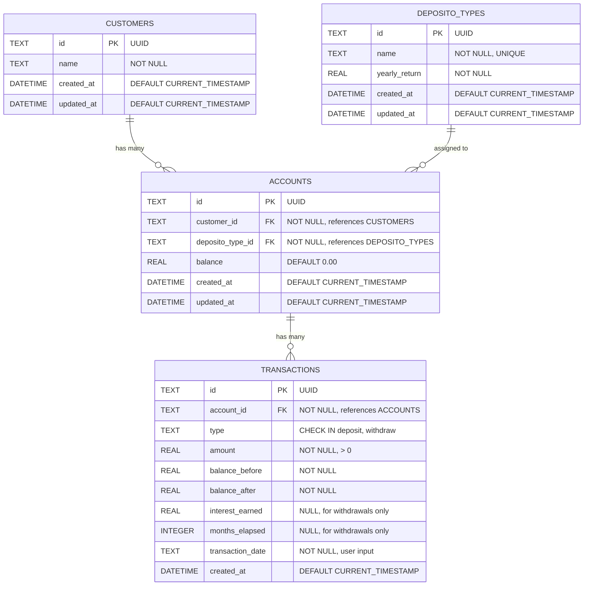

# Bank Saving System — Database Design

## 1. Entity Relationship Diagram



## 2. Table Definitions (SQL)

### customers
```sql
CREATE TABLE IF NOT EXISTS customers (
    id TEXT PRIMARY KEY,
    name TEXT NOT NULL,
    created_at DATETIME DEFAULT CURRENT_TIMESTAMP,
    updated_at DATETIME DEFAULT CURRENT_TIMESTAMP
);
```

### deposito_types
```sql
CREATE TABLE IF NOT EXISTS deposito_types (
    id TEXT PRIMARY KEY,
    name TEXT NOT NULL UNIQUE,
    yearly_return REAL NOT NULL,
    created_at DATETIME DEFAULT CURRENT_TIMESTAMP,
    updated_at DATETIME DEFAULT CURRENT_TIMESTAMP
);
```

### accounts
```sql
CREATE TABLE IF NOT EXISTS accounts (
    id TEXT PRIMARY KEY,
    customer_id TEXT NOT NULL,
    deposito_type_id TEXT NOT NULL,
    balance REAL DEFAULT 0.00,
    created_at DATETIME DEFAULT CURRENT_TIMESTAMP,
    updated_at DATETIME DEFAULT CURRENT_TIMESTAMP,
    FOREIGN KEY (customer_id) REFERENCES customers(id),
    FOREIGN KEY (deposito_type_id) REFERENCES deposito_types(id)
);
```

### transactions
```sql
CREATE TABLE IF NOT EXISTS transactions (
    id TEXT PRIMARY KEY,
    account_id TEXT NOT NULL,
    type TEXT NOT NULL CHECK(type IN ('deposit', 'withdraw')),
    amount REAL NOT NULL CHECK(amount > 0),
    balance_before REAL NOT NULL,
    balance_after REAL NOT NULL,
    interest_earned REAL,
    months_elapsed INTEGER,
    transaction_date TEXT NOT NULL,
    created_at DATETIME DEFAULT CURRENT_TIMESTAMP,
    FOREIGN KEY (account_id) REFERENCES accounts(id)
);
```

## 3. Seed Data

### Default Deposito Types
| Name | Yearly Return |
|------|--------------|
| Deposito Bronze | 3% |
| Deposito Silver | 5% |
| Deposito Gold | 7% |

## 4. Indexes

```sql
CREATE INDEX IF NOT EXISTS idx_accounts_customer ON accounts(customer_id);
CREATE INDEX IF NOT EXISTS idx_accounts_deposito ON accounts(deposito_type_id);
CREATE INDEX IF NOT EXISTS idx_transactions_account ON transactions(account_id);
CREATE INDEX IF NOT EXISTS idx_transactions_date ON transactions(transaction_date);
```

## 5. Design Decisions

1. **UUIDs as Primary Keys**: Portable, no auto-increment conflicts, safe for distributed systems
2. **SQLite**: Zero configuration, file-based, ideal for demo/test projects
3. **Soft Timestamps**: `created_at` and `updated_at` for audit trail
4. **Transaction Log**: Every deposit/withdraw creates an immutable record
5. **Interest on Withdrawal**: Calculated and stored in the transaction record for auditability
