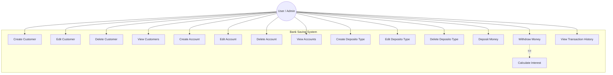
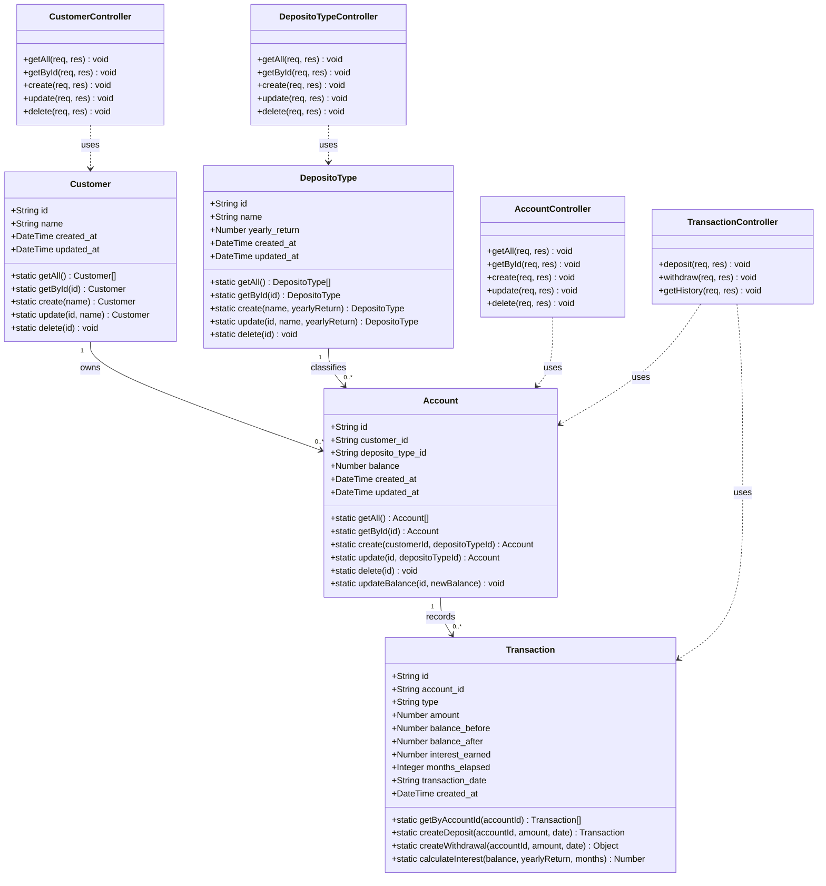
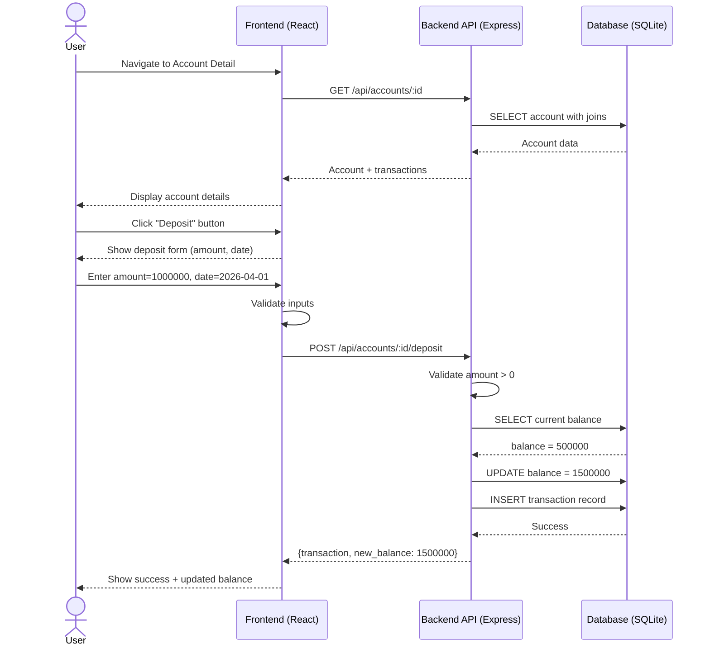
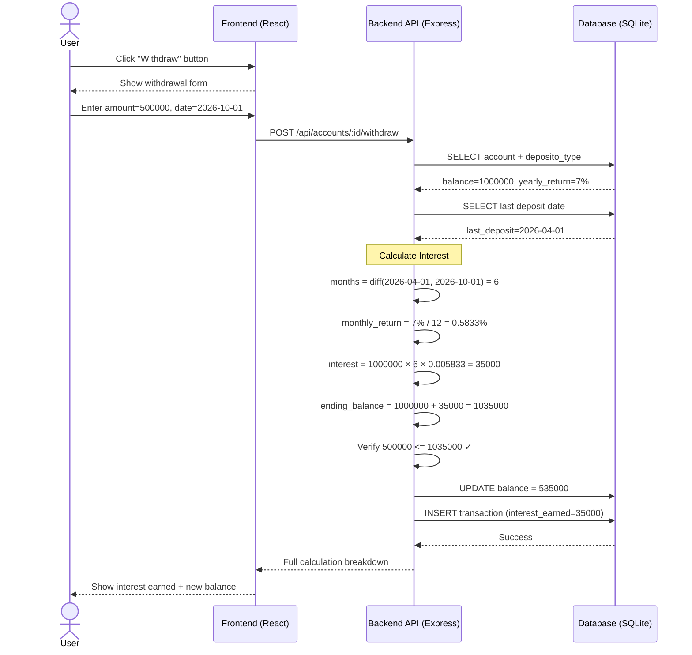
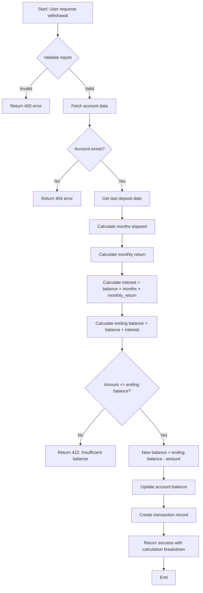

# Bank Saving System — UML Diagrams

## 1. Use Case Diagram

## 2. Class Diagram

## 3. Sequence Diagram — Deposit Flow

## 4. Sequence Diagram — Withdrawal with Interest Calculation

## 5. Activity Diagram — Withdrawal Process

