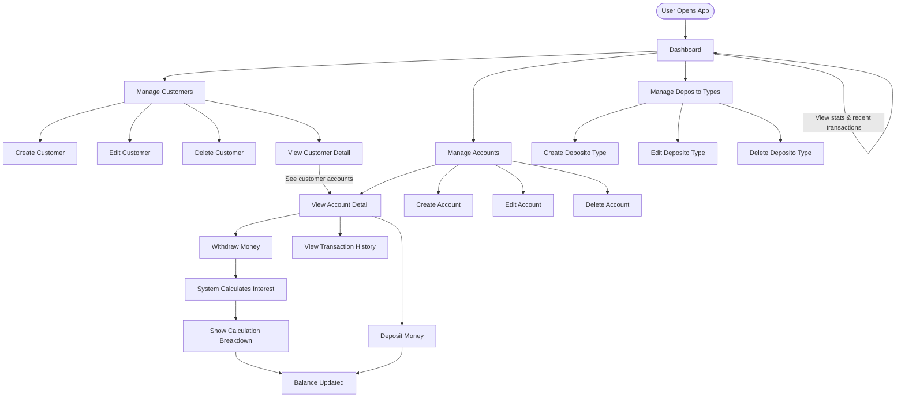
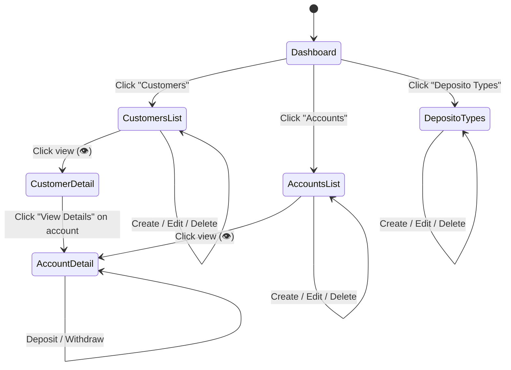

# Bank Saving System — User Journey & Wireframe

## 1. User Journey Overview

The Bank Saving System supports one primary actor: **Admin/Teller**, who manages customers, accounts, deposito types, and performs financial transactions.



---

## 2. Detailed User Journeys

### Journey 1: Onboarding a New Customer

| Step | Screen | Action | Result |
|------|--------|--------|--------|
| 1 | Dashboard | User sees overview, clicks "Customers" in sidebar | Navigate to Customers |
| 2 | Customers List | Clicks "Add Customer" button | Create modal opens |
| 3 | Create Customer Modal | Enters customer name, clicks "Create" | Customer created, toast success |
| 4 | Customers List | New customer appears in table | Customer is ready for accounts |

### Journey 2: Opening a Savings Account

| Step | Screen | Action | Result |
|------|--------|--------|--------|
| 1 | Sidebar | Clicks "Accounts" | Navigate to Accounts |
| 2 | Accounts List | Clicks "Add Account" | Create modal opens |
| 3 | Create Account Modal | Selects a customer from dropdown | Customer assigned |
| 4 | Create Account Modal | Selects a deposito type (e.g., Gold 7%) | Deposito type assigned |
| 5 | Create Account Modal | Clicks "Create" | Account created with balance Rp 0 |
| 6 | Accounts List | New account appears with customer name & deposito type | Ready for deposits |

### Journey 3: Making a Deposit

| Step | Screen | Action | Result |
|------|--------|--------|--------|
| 1 | Accounts List | Clicks the eye icon on an account row | Navigate to Account Detail |
| 2 | Account Detail | Sees current balance, deposito info, transaction history | User reviews account |
| 3 | Account Detail | Clicks "Deposit" button | Deposit modal opens |
| 4 | Deposit Modal | Enters amount (e.g., Rp 1,000,000) | Amount entered |
| 5 | Deposit Modal | Selects deposit date (e.g., 2026-04-01) | Date selected |
| 6 | Deposit Modal | Sees "New balance will be: Rp 1,000,000" preview | User confirms preview |
| 7 | Deposit Modal | Clicks "Deposit" | Transaction created |
| 8 | Account Detail | Balance updated, transaction appears in history | Deposit complete |

### Journey 4: Making a Withdrawal (with Interest Calculation)

| Step | Screen | Action | Result |
|------|--------|--------|--------|
| 1 | Account Detail | Clicks "Withdraw" button | Withdraw modal opens |
| 2 | Withdraw Modal | Enters amount (e.g., Rp 500,000) | Amount entered |
| 3 | Withdraw Modal | Selects withdrawal date (e.g., 2026-10-01) | Date selected |
| 4 | Withdraw Modal | Sees "Current balance + interest will be calculated" | User understands |
| 5 | Withdraw Modal | Clicks "Withdraw" | System processes withdrawal |
| 6 | Calculation Breakdown | **System shows:** | |
|   | | Starting Balance: Rp 1,000,000 | |
|   | | Yearly Return: 7% | |
|   | | Monthly Return: 0.5833% | |
|   | | Months Elapsed: 6 | |
|   | | Interest Earned: +Rp 35,000 | |
|   | | Balance with Interest: Rp 1,035,000 | |
|   | | Withdrawal Amount: -Rp 500,000 | |
|   | | **Final Balance: Rp 535,000** | |
| 7 | Account Detail | Clicks "Done", balance updated to Rp 535,000 | Withdrawal complete |

### Journey 5: Managing Deposito Types

| Step | Screen | Action | Result |
|------|--------|--------|--------|
| 1 | Sidebar | Clicks "Deposito Types" | Navigate to Deposito Types |
| 2 | Deposito Types | Sees cards for Bronze (3%), Silver (5%), Gold (7%) | Overview of all packages |
| 3 | Deposito Types | Clicks "Add Deposito Type" | Create modal opens |
| 4 | Create Modal | Enters name "Deposito Platinum", yearly return "10" | Form filled |
| 5 | Create Modal | Sees "Monthly return will be: 0.8333%" preview | User confirms |
| 6 | Create Modal | Clicks "Create" | New deposito type created |

---

## 3. Wireframe Descriptions

### 3.1 Dashboard Wireframe
```
┌──────────────────────────────────────────────────────────┐
│  🏦 BankSave               │  Dashboard                 │
│  Bank Saving System         │                            │
│─────────────────────────────┤                            │
│  NAVIGATION                 │  ┌──────┐ ┌──────┐ ┌──────┐ ┌──────┐
│  📊 Dashboard  ←active      │  │👤 12 │ │💳 8  │ │💰 45M│ │📦 3  │
│  👤 Customers               │  │Cust. │ │Acct. │ │Bal.  │ │Types │
│  💳 Accounts                │  └──────┘ └──────┘ └──────┘ └──────┘
│  📦 Deposito Types          │                            │
│                             │  ┌─────────────────────────┐
│                             │  │  Recent Transactions     │
│                             │  │ Date  │Customer│Type│Amt │
│                             │  │ 01/04 │John    │↗Dep│1M  │
│                             │  │ 01/10 │John    │↙Wdr│500K│
│                             │  └─────────────────────────┘
└──────────────────────────────────────────────────────────┘
```

### 3.2 Customers List Wireframe
```
┌──────────────────────────────────────────────────────────┐
│  Customers                              [+ Add Customer] │
│  12 total customers                                      │
│  ┌──────────────────────────────────────────────────────┐│
│  │ 🔍 Search customers...                              ││
│  ├──────────────────────────────────────────────────────┤│
│  │ Name         │ Created        │ Actions              ││
│  │ John Doe     │ 23 Apr 2026    │ 👁 ✏️ 🗑           ││
│  │ Jane Smith   │ 22 Apr 2026    │ 👁 ✏️ 🗑           ││
│  └──────────────────────────────────────────────────────┘│
└──────────────────────────────────────────────────────────┘
```

### 3.3 Account Detail Wireframe
```
┌──────────────────────────────────────────────────────────┐
│  ← Account Detail                    [Deposit] [Withdraw]│
│  John Doe's Deposito Gold Account                        │
│  ┌──────────────────────────────────────────────────────┐│
│  │ Account ID  │ Customer    │ Deposito Type │ Return   ││
│  │ abc-123...  │ John Doe    │ 🏷 Gold       │ 7%      ││
│  │────────────────────────────────────────────────────  ││
│  │      Current Balance: Rp 1,035,000                   ││
│  └──────────────────────────────────────────────────────┘│
│  ┌──────────────────────────────────────────────────────┐│
│  │ 💰 Transaction History                  3 transactions│
│  │ Date  │Type    │Amount │Interest│Months│Before│After ││
│  │ 01/04 │↗ Dep   │1M     │-       │-     │0     │1M   ││
│  │ 01/10 │↙ Wdr   │500K   │+35K    │6 mo  │1M    │535K ││
│  └──────────────────────────────────────────────────────┘│
└──────────────────────────────────────────────────────────┘
```

### 3.4 Withdrawal Calculation Modal Wireframe
```
┌────────────────────────────────┐
│  Withdraw Money            ✕  │
│───────────────────────────────│
│  💰 Withdrawal Calculation     │
│                                │
│  Starting Balance    Rp 1,000K │
│  Yearly Return       7%        │
│  Monthly Return      0.5833%   │
│  Months Elapsed      6 months  │
│  Interest Earned    +Rp 35,000 │
│  Balance w/ Interest Rp 1,035K │
│  Withdrawal Amount  -Rp 500K   │
│  ─────────────────────────────│
│  Final Balance       Rp 535K   │
│───────────────────────────────│
│                        [Done]  │
└────────────────────────────────┘
```

---

## 4. Application Navigation Flow


